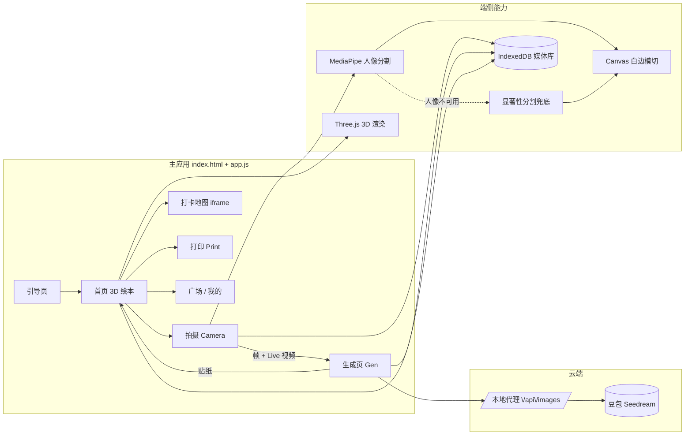

# 素履记 · Live 贴纸旅行手账

> **#Guikesong** 贵客松参赛作品 · 「素履记」的 Web 原型（代码中产品代号「素行记」）
>
> 把旅行「沉下去，带回来」：拍一段 Live，AI 把它变成手账贴纸，贴进一本 3D 绘本，钉在贵州的手绘地图上，最后打印成拿在手里的实体手账。


---

## 目录

- [产品是什么](#产品是什么)
- [核心功能](#核心功能)
- [技术栈总览](#技术栈总览)
- [架构一览](#架构一览)
- [关键实现细节](#关键实现细节)
  - [抠图贴纸引擎](#1-抠图贴纸引擎-cutoutjs)
  - [AI 风格生成](#2-ai-风格生成豆包-seedream-本地代理)
  - [3D 绘本](#3-3d-绘本-book3djs--mascot3djs)
  - [打卡地图子应用](#4-打卡地图子应用-map)
  - [存储分层](#5-存储分层-localstorage--indexeddb)
- [目录结构](#目录结构)
- [快速开始](#快速开始)
- [可选：启用 AI 风格生成](#可选启用-ai-风格生成)

---

## 产品是什么

**素履记**是一款面向贵州文旅的 AI 旅游手账产品，名字取自《周易》「素履往，无咎」。

旅行中最珍贵的瞬间往往止步于相册。素履记让它们以另一种方式留下来：

```
拍摄 Live ──► AI 生成贴纸 ──► 贴进 3D 绘本 ──► 钉上手绘地图 ──► 导出打印
   (拍)         (贴 / AI)         (记)            (钉)           (印)
```

- **沉下去**：不止打卡景区，更走进村寨、市集与田野——西江苗寨、黄果树、梵净山、天眼、村超，都是可以被「贴」进手账的素材；
- **带回来**：数字记忆最终落成纸质手账，每一段旅程都有迹可循、有物可赠。

本仓库是 **贵客松（#Guikesong）黑客松期间开发的 Web 原型**：纯前端、零构建、开箱即跑，完整实现了「拍 → 贴 → 钉 → 记 → 印」的核心闭环。

## 核心功能

| 模块 | 说明 |
| --- | --- |
| 📷 **Live 拍摄** | 调用摄像头拍一段 3 秒 Live（`getUserMedia` + `MediaRecorder`），支持前后摄像头切换、闪光灯 |
| ✂️ **抠图贴纸** | 拍摄后自动抠出主体、裁出白边，生成异形模切贴纸（MediaPipe 人像分割 + 显著性兜底） |
| 🎨 **AI 风格** | 卡通 / 油画 / 抽象三种 AI 画风（豆包 Seedream 图像生成），AI 不可用时自动回退 CSS 滤镜 |
| 📖 **3D 绘本** | Three.js 渲染的立体手账本，支持拖拽贴纸、双指缩放、手写涂鸦、添加文字、表情 |
| 🗺️ **打卡地图** | 手绘风贵州地图子应用（iframe 集成），26 个景区贴纸随打卡点亮 |
| 🖨️ **打印手账** | 绘本内容排版导出，可打印成实体册子 |
| 🧑‍🤝‍🧑 **广场 / 我的** | 贴纸广场浏览、个人书架与成果墙 |
| 🔐 **隐私范围** | 公开范围设置（draft14） |

## 技术栈总览

**主应用（根目录）—— 零构建、无框架的原生 Web 应用：**

| 层 | 技术 | 用途 |
| --- | --- | --- |
| 语言 / 运行时 | 原生 JavaScript (ES2020+)、HTML5、CSS3 | 无框架、无打包器，`<script>` 直接加载 |
| UI 结构 | 多视图 SPA（`view-*` 切换）+ 自建 SVG 图标系统（`icons.js`） | 引导页 / 首页 / 拍摄 / 生成 / 广场 / 我的 / 打印 |
| Web 组件 | [Shoelace](https://shoelace.style/)（autoloader） | Toast 提示条等 UI 组件 |
| 3D 渲染 | [Three.js](https://threejs.org/)（`vendor/three.min.js`） | 3D 绘本、3D 吉祥物（程序化几何拼装建模） |
| 翻页效果 | [StPageFlip](https://github.com/Nodlick/StPageFlip)（`page-flip.browser.js`） | 绘本翻页 |
| 动画 | [GSAP 3.12.5](https://gsap.com/) | 视图过渡 / 微交互动画 |
| 端侧 AI | [MediaPipe Selfie Segmentation](https://developers.google.com/mediapipe)（CDN 懒加载） | 人像主体分割 |
| 云端 AI | 豆包（火山方舟）Seedream 图像生成，经本地代理 `/api/images` | 卡通 / 油画 / 抽象风格化，密钥走环境变量 |
| 图像处理 | Canvas 2D / `ImageData` / `globalCompositeOperation` | 抠图、白边模切、滤镜、贴纸合成 |
| 摄像头 | `getUserMedia` + `MediaRecorder` | Live 3 秒视频拍摄与回放 |
| 存储 | `localStorage`（元数据）+ IndexedDB（大媒体，库名 `suoxingji`） | 元数据与大文件分层，绕开 5MB 配额 |
| 字体 | 霞鹜文楷（LXGW WenKai）、青春体 | 手账手写质感 |

**打卡地图子应用（`map/`）—— 独立构建的 Vite 应用：**

| 技术 | 用途 |
| --- | --- |
| Vite 构建产物（`index-*.js` / `index-*.css`，已预构建提交） | 以 iframe 嵌入主应用「地图」页 |
| 手绘地形底图（2400 × 1800 WebP）+ 市州雾层 / 边界层 / 贴纸层分层渲染 | 贵州省手绘地图 |
| 26 个景区贴纸（黄果树、梵净山、天眼、西江千户苗寨、镇远、肇兴、赤水、万峰林、织金洞…） | 打卡点亮 + `manifest.json` 资产清单 |
| LXGW WenKai woff2 分片子集化 | 地图字体按需加载 |

## 架构一览



## 关键实现细节

### 1. 抠图贴纸引擎（`cutout.js`）

三级策略，保证任何照片都能出贴纸：

1. **人像分割**：MediaPipe Selfie Segmentation（CDN 懒加载，4s 超时保护），人像覆盖率 > 3% 才采用；
2. **显著性兜底**：非人像场景走自研启发式——在 48×48 下采样图上计算「饱和度 × 0.7 + 中心先验 × 0.3 + 亮度梯度」，均值 + 0.6σ 阈值化后取最大连通域（BFS），空结果再退化为中心椭圆；
3. **异形模切白边**：mask 逐像素透明化 → mask 多向偏移叠印 + `source-in` 涂白（近似形态学膨胀，`blur(2px)` 柔边）→ 按内容包围盒裁切，输出带白边的 PNG 贴纸。

### 2. AI 风格生成（豆包 Seedream 本地代理）

- 内置画风：**写实**（原图直出）/ **卡通** / **油画** / **抽象**，每个画风对应一条中文风格化 prompt；
- 请求发往同源代理 `POST /api/images`（body：`{ prompt, image, size }`），90 秒超时熔断；
- **任何失败都回退 CSS 滤镜**（`saturate / contrast / hue-rotate` 预设），保证离线 / 无密钥也能出图；
- API Key 只存在代理服务端环境变量，前端零密钥。

### 3. 3D 绘本（`book3d.js` + `mascot3d.js`）

- `book3d.js`（约 1300 行）：Three.js 渲染立体手账，`page_left / page_right / page_shell` 贴图为页面，支持三级地域切换（中国 › 贵州 › 黔东南）、翻页、贴纸拖放、手写涂鸦层（`draw-layer` canvas）；
- `mascot3d.js`：吉祥物完全**程序化建模**（球体 / 胶囊 / 圆环拼装出小狐狸摄影师），零模型文件；
- 桌面摆件（相机、明信片、折页地图等）以 `env_*.png` 贴图呈现。

### 4. 打卡地图子应用（`map/`）

- 独立 Vite 工程，构建产物直接提交，主应用以 **iframe** 集成；
- 分层渲染：暖米色底 → 手绘地形（`guizhou-terrain.webp`，2400 × 1800）→ 市州雾层 → 边界层 → 贴纸层；
- 26 个景区贴纸带 `manifest.json` 资产清单（尺寸 / 宽高比 / 置信度），底图缺失时优雅降级为占位层。

### 5. 存储分层（`idb.js` + `localStorage`）

- `localStorage` 只存贴纸**元数据**（ID、位置、类型），彻底绕开 5MB 配额；
- IndexedDB（库名 `suoxingji`，`media` objectStore）存 **frame / photo / video / frames** 等大媒体，容量按 GB 计。

## 目录结构

```
guiyang-travel/
├── index.html            # 单页入口：引导 / 首页 / 拍摄 / 生成 / 广场 / 我的 / 地图 / 打印
├── app.js                # 主逻辑（约 1600 行）：路由、拍摄、生成、贴纸、绘本交互
├── app.css               # 全部样式（移动端优先）
├── cutout.js             # 抠图贴纸引擎（MediaPipe + 显著性 + 白边模切）
├── book3d.js             # Three.js 3D 绘本
├── mascot3d.js           # 程序化建模的 3D 吉祥物
├── idb.js                # IndexedDB 大媒体存储
├── icons.js              # SVG 图标注入（data-icon）
├── vendor/               # three.min.js / page-flip / gsap / shoelace-autoloader
├── fonts/                # 霞鹜文楷 lite / 青春体
├── icons/                # Feather 风格 SVG 源图标
├── assets/               # 贴纸框、页面贴图、场景插画、画风示例图
└── map/                  # 打卡地图子应用（Vite 预构建产物 + 贴纸 / 材质资产）
    ├── index.html        # iframe 目标页
    ├── assets/           # 构建产物 JS / CSS
    ├── stickers/         # 26 个贵州景区贴纸 + manifest.json
    ├── textures/         # 纸张材质
    └── map/README.md     # 手绘地形底图规格说明
```

> 以下划线 `_` 开头的文件（`_wbx/`、`_install_wb.ps1` 等）是开发期工具与草稿，与运行无关。

## 快速开始

纯静态站点，无构建步骤，任意静态服务器即可运行：

```bash
# 方式一：Python
python3 -m http.server 8080

# 方式二：Node
npx serve .
```

打开 <http://localhost:8080>（建议用浏览器移动设备模拟或手机直接访问，摄像头功能需要 `localhost` 或 HTTPS 环境）。

无需任何配置即可体验：拍摄抠图（端侧 MediaPipe）、贴纸绘本、打卡地图、打印。**AI 风格生成**需要按下面方式启动本地代理，未启用时自动回退 CSS 滤镜，不影响其它功能。

## 可选：启用 AI 风格生成

前端会请求同源 `POST /api/images`，请求 / 响应约定：

```jsonc
// 请求
{ "prompt": "将这张照片转换为可爱卡通插画风…", "image": "data:image/png;base64,…", "size": "2K" }
// 响应
{ "ok": true, "image": "data:image/png;base64,…" }
```

最小代理示例（Express + 火山方舟，Key 走环境变量，切勿写进前端）：

```js
// server.js — node server.js 后访问 http://localhost:8080
import express from "express";
const app = express();
app.use(express.json({ limit: "20mb" }));
app.use(express.static("."));

app.post("/api/images", async (req, res) => {
  const r = await fetch("https://ark.cn-beijing.volces.com/api/v3/images/generations", {
    method: "POST",
    headers: {
      "Authorization": `Bearer ${process.env.ARK_API_KEY}`, // 环境变量注入
      "Content-Type": "application/json",
    },
    body: JSON.stringify({
      model: process.env.ARK_MODEL || "doubao-seedream-5-0",
      prompt: req.body.prompt,
      image: req.body.image,
      size: req.body.size || "2K",
      response_format: "b64_json",
    }),
  }).then(r => r.json());
  const b64 = r?.data?.[0]?.b64_json;
  b64 ? res.json({ ok: true, image: `data:image/png;base64,${b64}` })
      : res.json({ ok: false });
});

app.listen(8080);
```

```bash
ARK_API_KEY=你的火山方舟Key node server.js
```

---

素履记 · 沉下去，带回来。贵客松 #Guikesong 参赛作品 🌿
